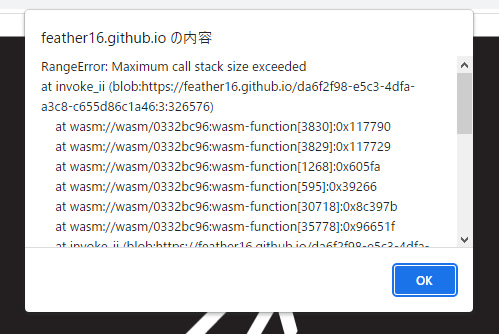

# Gravertical
製作途中のアクションシューティングゲーム 
UnityとC#を用いて製作しています。 
Gravity+Verticalがゲーム名の由来です。

矢印に触れると重力の方向が変わります。

https://user-images.githubusercontent.com/105288087/192090455-1dec2ac9-a57d-4cb5-b681-32eb5e2ed1ba.mp4

## 遊ぶ
ブラウザ上でプレイできます。
[**こちらをクリック！**](https://feather16.github.io/Gravertical/)

実行環境はパソコン推奨です。
モバイル端末でも動作しますが、レイアウトが崩れる可能性があります。

以下のようなエラーが出る場合や、ゲームが開始しない場合は、
ブラウザのキャッシュを削除すると治るはずです。

## ソースコード
[こちら](Assets/Scripts)

### 各ファイルの概要
ソースファイルは[Assets/Scripts](Assets/Scripts)に配置しています。
|ファイル名|内容|
|-|-|
[Title.cs](Assets/Scripts/Title.cs)|タイトル画面|
[StageSelect.cs](Assets/Scripts/StageSelect.cs)|ステージ選択画面|
[Game.cs](Assets/Scripts/Game.cs)|ゲーム画面|
[Menu.cs](Assets/Scripts/Menu.cs)|メニュー画面|
[Clear.cs](Assets/Scripts/Clear.cs)|ステージクリア時の処理|
[GameOver.cs](Assets/Scripts/GameOver.cs)|ゲームオーバー時の処理|
[HowTo.cs](Assets/Scripts/HowTo.cs)|操作方法画面|
[Credits.cs](Assets/Scripts/Credits.cs)|クレジット画面|
[FadeIn.cs](Assets/Scripts/FadeIn.cs)|フェードインの処理|
[Button.cs](Assets/Scripts/Button.cs)|UIのボタン|
[Entity.cs](Assets/Scripts/Entity.cs)|ゲーム中に登場するオブジェクト(これを継承して使う)|
[Player.cs](Assets/Scripts/Player.cs)|プレイヤー|
[Bullet.cs](Assets/Scripts/Bullet.cs)|プレイヤーが発射した弾|
[GravityChanger.cs](Assets/Scripts/GravityChanger.cs)|重力変更パネル|
[CrackedBreakableBlock.cs](Assets/Scripts/CrackedBreakableBlock.cs)|弾を当てると壊せるブロック|
[Thorn.cs](Assets/Scripts/Thorn.cs)|トゲ|
[Octopus.cs](Assets/Scripts/Octopus.cs)|タコ(敵モンスター)|
[BlueUFO.cs](Assets/Scripts/BlueUFO.cs)|青UFO(敵モンスター)|
[RedUFO.cs](Assets/Scripts/RedUFO.cs)|赤UFO(敵モンスター)|
[GreenUFO.cs](Assets/Scripts/GreenUFO.cs)|緑UFO(敵モンスター)|
[Jewel.cs](Assets/Scripts/Jewel.cs)|お宝|
[Dummy.cs](Assets/Scripts/Dummy.cs)|ステージの範囲を決めるための実体の無いオブジェクト|
[JewelEffect.cs](Assets/Scripts/JewelEffect.cs)|お宝取得時のエフェクト|
[Twinkle.cs](Assets/Scripts/Twinkle.cs)|お宝が発するキラキラ|
[RingEffect.cs](Assets/Scripts/RingEffect.cs)|リング状のエフェクト|
[DamageNumberEffect.cs](Assets/Scripts/DamageNumberEffect.cs)|ダメージを受けた/与えた際のエフェクト|

## 使用画像・音声
* イラスト
  * [pixabay](https://pixabay.com/ja/)
  * [イラストAC](https://www.ac-illust.com/)
* SE
  * [無料効果音で遊ぼう！](https://taira-komori.jpn.org/)
* BGM
  * タイトル
    * [踊る、宇宙の中で(Dancing,at_Universe)](https://dova-s.jp/bgm/play15951.html)
  * ゲーム
    * [Odyssey](https://dova-s.jp/bgm/play15206.html)
  * ゲーム（ハード）
    * [Speace_World](https://dova-s.jp/bgm/play15352.html)
  * 設定・クレジット
    * [日常のひととき](https://dova-s.jp/bgm/play10027.html)
    
## 使用ライブラリ・フォント
* [Joystick Pack](https://assetstore.unity.com/packages/tools/input-management/joystick-pack-107631)
* [uGUI-Hypertext](https://github.com/setchi/uGUI-Hypertext)
* [Noto Sans Japanese](https://fonts.google.com/noto/specimen/Noto+Sans+JP)

## 製作期間
2022年4月～
